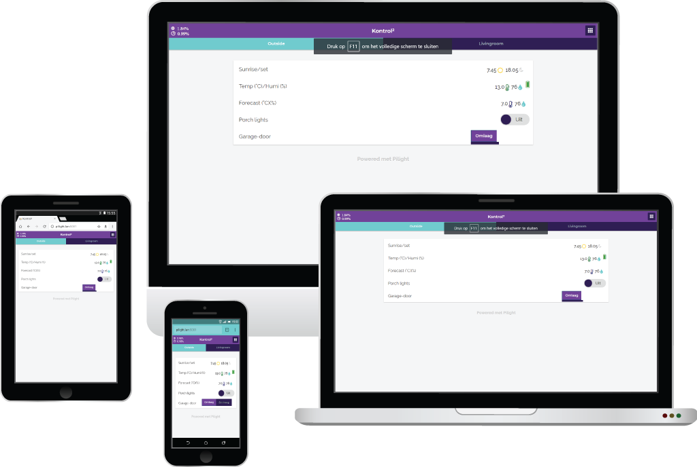

# An Updated WebGUI for Pilight with Kontrol⁵⁸ theme
Customized Pilight theme with vector graphics and HTML5/some CSS animation. Responsive, fast and materialized flat look.

## Screenshots

## Installation
Be sure Pilight is not running before proceed with installation!

#### Windows
1. Make a backup of the original `webgui` folder of Pilight:
`move c:\pilight\webgui c:\pilight\webgui-old`
2. Unzip the downloaded zip file to the:
`c:\pilight\`
3. Rename the extracted directory to `webgui`.

#### Linux
1. Make a backup of the original `webgui` folder of Pilight:
`mv /usr/local/share/pilight/webgui /usr/local/share/pilight/webgui-old`
2. Clone the repository in place of the original folder:
`git -C /usr/local/share/pilight/ clone -b kontrol http://github.com/gregnau/webgui.git`

In both cases after the Pilight server (re)started, the new look should be appearing on load. If still the old skin loading, then try to refresh a couple of times or empty the browser cache.

## Requirements
It requires a working installation of Pilight version 8.0.2.
